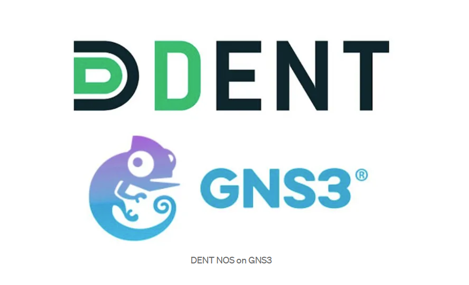
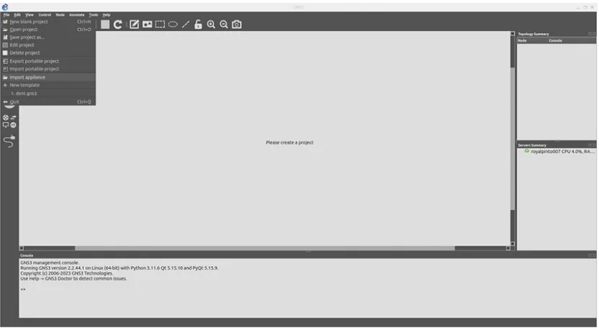
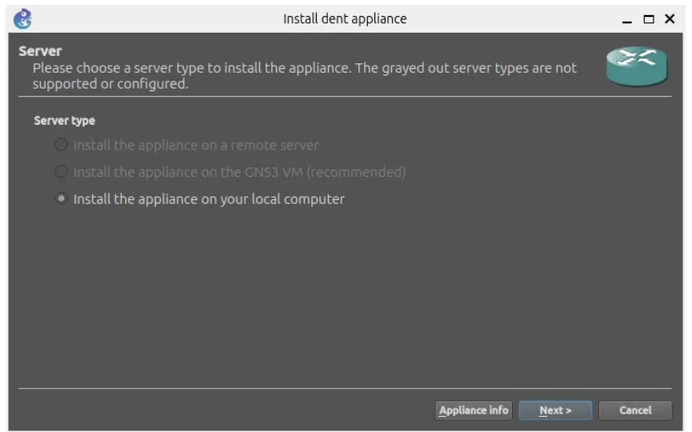
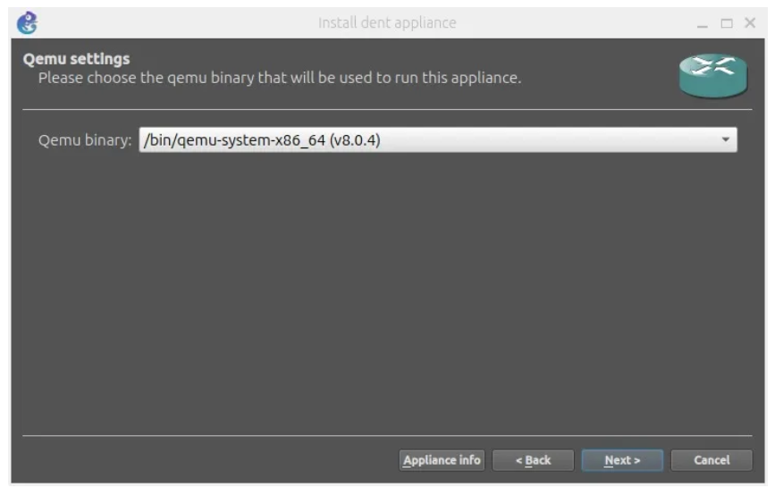
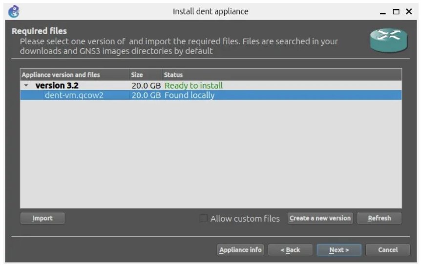
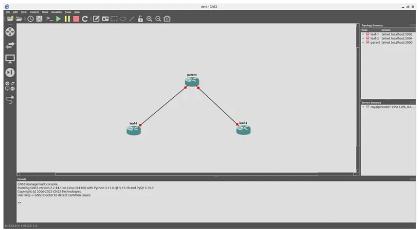
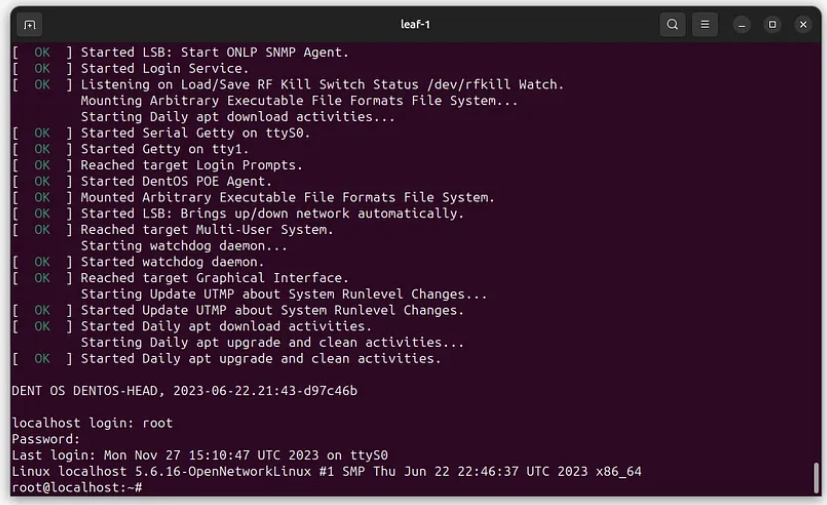

# How to Install the DENT NOS on GNS3

**Whether you are intending on using the DENT Network Operating System
in GNS3 with a remote server, a virtual machine or your local machine,
this guide will show you the step-by-step instructions on how
to complete this.**

*Note the installation on a remote server, virtual machine, and your
local machine will be similar.*

## Using a remote server to run the DENT NOS in GNS3

(TODO)

## Using a virtual machine to run the DENT NOS in GNS3

First, install the DENT GNS3 appliance file as well as the disk
image for the dent Virtual Machine. You can find the required files
here:** [DENT Image and gns3a file](https://1drv.ms/f/s!AkTUp6FU_dW0gt4dlXatZOhyr8boog?e=Ltqpa5.)

Install the appropirate GNS3 VM for your machine

If you are using VMware Workstation Pro, install the VMWare
Workstation and Fusion GNS3 VM and extract the .zip folder you
downloaded.

Open VMWare Workstation then click Open a Virtual Machine and
select the extracted GNS3 VMWare Workstation folder.

When ready, run the Virtual Machine. You should see a screen
similar to this below once the Virtual machine is running.

Now Open GNS3, go to Edit -> Preferences -> GNS3 VM and check
the “Enable the (GNS3) VM” box. Select the appropriate Virtual
Machine you are running GNS3 on as your Virtualization Engine
and click ok

You Should now See an Additional Server Listed under Server Summary

Go to File -> Import Appliance and select the appliance file.
In this scenario we will select one of the previously downloaded
files “DENT - 3.2”.

The QEMU binary that will be used to run this appliance is
recommended as /bin/qemu-system-x86_64(v4.2.1).

Next, we need to import the DENT image file by selecting again
one of the previously downloaded files “dent-vm.qcow2” and clicking
import.

**Wait for the upload to finish, it may take some time.**

Once the upload is finished, you may click next and yes to
install DENT

Once Installed you may now use the DENT appliance in GNS3.
The example below demonstrate 3 dent appliances connecting to
each other

After Starting the simulation you may right-click on any DENT
appliance and select _console_ to log-in.

**The default credentials are:**
- **Localhost login: root**
- **Password: onl**

### You have now successfully set up DENT in GNS3 with a virtual machine

For more information on how to set up DENT in GNS3 with a virtual
machine feel free to contact the author Korel Ucpinar at
Korelucpinar@gmail.com

## Using your local machine to run the DENT NOS in GNS3

**DENT NOS, a Linux Foundation project, redefines network operating
systems by leveraging the Linux Kernel and Switchdev. Treating all
infrastructure equally, it simplifies abstractions.**

**This guide explores integrating DENT NOS with GNS3, streamlining the
simulation of disaggregated networks. Uncover the power of DENT NOS
in a virtualized environment with a quick installation walkthrough.
Let’s dive in!**

### Prerequisites
- [GNS3](https://docs.gns3.com/docs/) installed on your system.

### Installation Steps

### 1. Download DENT NOS Files
Visit the DENT NOS repository on OneDrive to download the required
files:  
[DENT NOS Files](https://onedrive.live.com/?authkey=%21AJV2rWTocq%5FG6KI&id=B4D5FD54A1A7D444%2144829&cid=B4D5FD54A1A7D444)

### 2. Uncompress Disk Image
Uncompress the downloaded disk image file.

### 3. Import Appliance to GNS3

1. Open GNS3 and go to `File -> Import Appliance. `
2. Select the GNS3 appliance file _(gns3a file)_ you downloaded
   from the OneDrive link.
3. Choose the server on which to run the appliance.

### 4. Choose QEMU Binary
1. Choose the QEMU binary that will be used to run the DENT NOS
   appliance.
2. The recommended option is `/bin/qemu-system-x86_64 (v8.0.4).`

### 5. Import DENT NOS Image
1. Click on the DENT NOS image file and import it.
2. Wait for the upload to finish; this may take some time.

### 6. Confirm Installation
1. You will be prompted with an installation confirmation.
2. Click “Yes” to confirm the installation.

    

### 7. DENT NOS Installation Complete
Congratulations!  
You have successfully installed DENT NOS on GNS3.

### 8. Start Using DENT NOS in GNS3
1. Drag the DENT NOS appliance into the main window of your GNS3 project.
2. Create your network topology, adding DENT NOS appliances as needed.
3. Right-click on each appliance and select “Start” to initiate the simulation.

### 9. Default Credentials
- DENT login: root
- Password: onl

### Conclusion
Congratulations! You’ve seamlessly integrated DENT NOS with GNS3, unlocking the potential for streamlined simulations of disaggregated networks.

As you explore the power of DENT NOS within this virtualized environment, experiment with diverse network configurations and scenarios to enhance your understanding.

**Happy networking!**

For more information on how to set up DENT in GNS3 with a local
machine feel free to contact the author Royal Simpson Pinto at
royalpinto007@gmail.com
